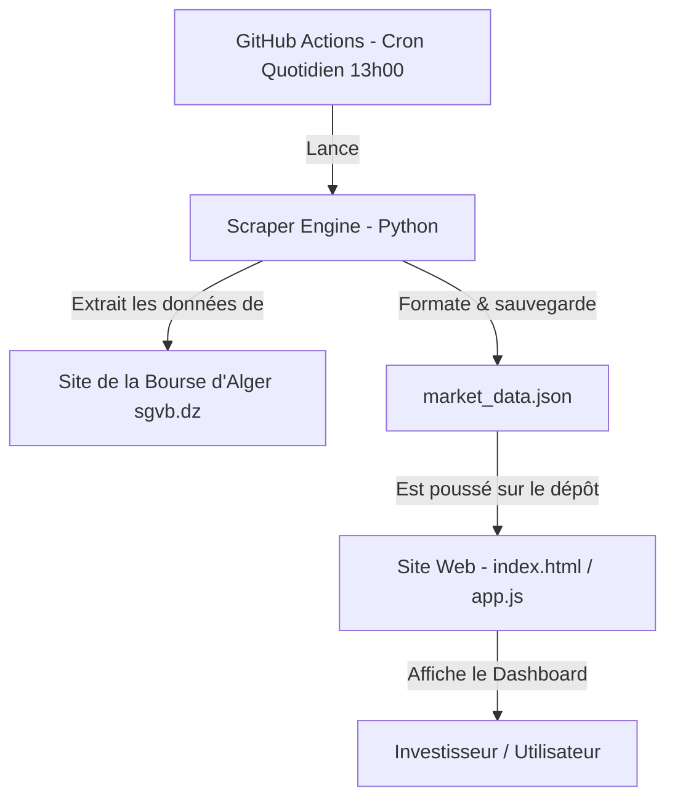

# Plan d'Implémentation - BourseWatch DZ (Plateforme Bourse d'Alger)

Ce document présente le plan technique détaillé pour créer un nouveau site web moderne et consolidé nommé **BourseWatch DZ**. Ce projet agrège toutes les informations éparpillées du site officiel (`sgvb.dz`), automatise leur actualisation quotidienne via un scraper et propose un tableau de bord financier haut de gamme.

---

## 🎯 Objectif du Projet

Créer une plateforme web monopage, fluide, esthétique et réactive, alimentée par un script d'extraction quotidien. L'utilisateur pourra :
1. Consulter les indicateurs globaux du jour (Valeur du **Dzair Index**, Capitalisation globale, Volume et Valeur globale des échanges).
2. Parcourir les actions cotées et trier/filtrer les données par secteur d'activité, rendement ou performance.
3. Accéder au marché des Obligations Assimilables du Trésor (**OAT** / Marché obligataire algérien), souvent ignoré mais représentant la majorité des échanges réels.
4. Visualiser les **Top Hausse / Top Baisse** du jour et la répartition sectorielle du marché.
5. Consulter l'historique de l'indice Dzair Index sous forme de graphique linéaire dynamique.
6. Télécharger directement les derniers **Bulletins Officiels de la Cote (BOM)** PDF archivés par le scraper.
7. Automatiser la mise à jour quotidienne à 13h00 (après la clôture de la séance de 12h30) de manière 100% gratuite.

---

## 🏗️ Architecture du Système

Le site fonctionnera selon un modèle **JAMstack serverless** :

*   **Avantage majeur :** Aucun coût d'hébergement de serveur ni de base de données. Le site est statique, ultra-rapide et s'actualise automatiquement via les actions GitHub (ou une tâche planifiée locale).

---

## 📄 Fichiers & Composants du Projet

### 1. Extracteur de Données
#### [scraper.py](file:///d:/DEV%20APP%20GRAVITY/Nouveau%20dossier%20(2)/scraper.py)
Un script Python robuste utilisant `HTMLParser` pour extraire :
*   La date de la séance et le statut du marché (Ouvert/Fermé).
*   L'indice **Dzair Index** et sa variation.
*   Les cotations des Actions (Ticker, Nom, Secteur, Cours, Plus haut, Plus bas, Volume, Valeur, Variation %).
*   Les cotations des Obligations (OAT) : Nom, Taux de coupon, Échéance, Volume.
*   Les liens vers les derniers Bulletins PDF.
Il enregistre ces données structurées dans `market_data.json`.

### 2. Base de Données Légère
#### [market_data.json](file:///d:/DEV%20APP%20GRAVITY/Nouveau%20dossier%20(2)/market_data.json)
Fichier JSON contenant :
*   Les statistiques de la séance en cours.
*   La liste des actions cotées.
*   La liste des obligations cotées.
*   Un historique des 30 dernières séances du Dzair Index pour tracer le graphique de tendance.

### 3. Interface Utilisateur (Dashboard)
#### [index.html](file:///d:/DEV%20APP%20GRAVITY/Nouveau%20dossier%20(2)/index.html)
Refonte complète du fichier précédent pour l'adapter aux données dynamiques réelles :
*   **Module Header :** Date de séance active, indicateur visuel de statut du marché.
*   **Module Indicateurs (KPIs) :** Blocs d'analyse de la séance (Volume total, Valeur totale, Capitalisation globale).
*   **Module Graphique :** Graphique de tendance interactif pour le Dzair Index avec zoom et tooltips.
*   **Module Tableaux (Onglets) :** 
    *   *Actions :* Tableau triable et filtrable avec recherche.
    *   *Obligations OAT :* Tableau des obligations du trésor.
    *   *Bulletins de la Cote :* Liens directs vers les PDF officiels.
*   **Module Palmarès :** Classement des hausses et baisses de la séance.
*   **Module Répartition :** Graphique circulaire SVG représentant la part de chaque secteur dans la capitalisation totale.
*   **Module Fiche Société :** Drawer (panneau latéral) réactif affichant les détails d'une entreprise au clic (description, capital, rendement, chart de dividendes).

### 4. Automatisation
#### [.github/workflows/auto_update.yml](file:///d:/DEV%20APP%20GRAVITY/Nouveau%20dossier%20(2)/.github/workflows/auto_update.yml)
Fichier de configuration de workflow GitHub Actions configuré comme tâche planifiée (`cron: '0 12 * * 1-5'` soit 13:00 heure d'Alger, du lundi au vendredi) qui exécute le scraper et met à jour automatiquement le site.

---

## 🔒 Choix d'Hébergement et Sécurité (Option 1)
*   Le code source est stocké dans un dépôt **GitHub Privé**.
*   L'automatisation s'effectue via **GitHub Actions** (2 000 min/mois incluses gratuitement).
*   Le site est déployé gratuitement sur **Vercel** ou **Netlify**, qui offre un connecteur de dépôt privé gratuit, et est mis à jour à chaque push du scraper.
